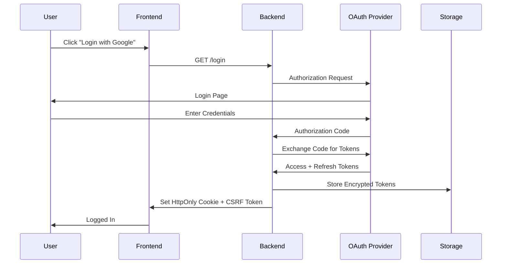
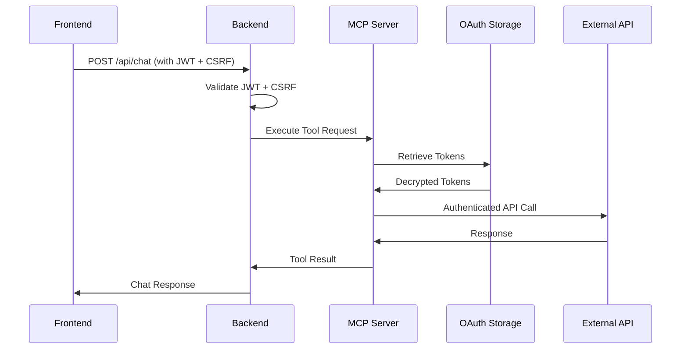

# SECURIVA API Integration Guide

> **Version:** 1.0.0  
> **Last Updated:** February 2026  
> **Maintainer:** SECURIVA Development Team

## 📋 Table of Contents

- [Overview](#overview)
- [Architecture](#architecture)
- [Quick Start](#quick-start)
- [Authentication](#authentication)
- [Integrated Services](#integrated-services)
- [Data Flow](#data-flow)
- [Security](#security)
- [Related Documentation](#related-documentation)

---

## Overview

SECURIVA is an AI-assisted platform that integrates multiple business operation APIs with strong cybersecurity safeguards. This documentation explains how each API integration works and how they interact within the system.

### Integrated Services

| Service | Purpose | Status | Authentication |
|---------|---------|--------|----------------|
| **Google OAuth** | Gmail, Calendar access | ✅ Production | OAuth 2.0 |
| **Salesforce** | CRM operations | ✅ Production | OAuth 2.0 |
| **Telesign** | SMS, Phone verification | ✅ Production | API Key |
| **WhatsApp Business** | Messaging | 🔜 Premium | API Key |
| **OpenAI/Groq** | LLM processing | ✅ Production | API Key |
| **Deepgram** | Voice-to-Text | ✅ Production | API Key |
| **VAPI** | Voice agent platform | ✅ Production | Webhook |

---

## Architecture

### High-Level System Architecture

```
┌─────────────────────────────────────────────────────────────────┐
│                         FRONTEND (React)                        │
│                    http://localhost:5173                        │
└────────────────────────────┬─────────────���──────────────────────┘
                             │
                             │ HTTP/WebSocket
                             ▼
┌─────────────────────────────────────────────────────────────────┐
│                    BACKEND (Python/Starlette)                   │
│                    http://localhost:8000                        │
├─────────────────────────────────────────────────────────────────┤
│  ┌──────────────┐  ┌──────────────┐  ┌──────────────┐        │
│  │  API Server  │  │  Auth Server │  │  MCP Server  │        │
│  │  (app.py)    │  │  (JWT)       │  │  (Tools)     │        │
│  └──────┬───────┘  └──────┬───────┘  └──────┬───────┘        │
│         │                  │                  │                 │
│         └──────────────────┴──────────────────┘                 │
│                             │                                    │
└─────────────────────────────┼────────────────────────────────────┘
                              │
                ┌───���─────────┴─────────────┐
                │                           │
                ▼                           ▼
    ┌───────────────────┐       ┌──────────────────┐
    │  OAuth Storage    │       │  Token Storage   │
    │  (oauth.json)     │       │  (encrypted)     │
    └───────────────────┘       └──────────────────┘
                │
                └─────────────┬─────────────┐
                              │             │
                              ▼             ▼
                    ┌─────────────┐  ┌──────────────┐
                    │   Google    │  │  Salesforce  │
                    │   APIs      │  │   APIs       │
                    └─────────────┘  └──────────────┘
                              │
                    ┌─────────┴──────────┐
                    │                    │
                    ▼                    ▼
          ┌─────────────┐      ┌──────────────┐
          │  Telesign   │      │   Voice AI   │
          │  (SMS/WA)   │      │  (Deepgram)  │
          └─────────────┘      └──────────────┘
```

### Request Flow

1. **User Authentication:**
   ```
   Frontend → /api/status → Backend → Auth Server → JWT Generation
                                   ↓
                          Sets HttpOnly Cookie + CSRF Token
   ```

2. **API Call with Tools:**
   ```
   Frontend → /api/chat → Backend → MCP Server → External APIs
                              ↓
                    Validates JWT + CSRF
                              ↓
                    Retrieves OAuth Tokens
                              ↓
                    Executes Tool Calls
                              ↓
                    Returns Response
   ```

---

## Quick Start

### Prerequisites

```bash
# Required software
- Python 3.11+
- Node.js 18+
- uv (Python package manager)
```

### Installation

```bash
# 1. Clone repository
git clone https://github.com/madhunivi77/SECURIVA.git
cd SECURIVA

# 2. Setup backend
cd backend
uv sync
cp .env.example .env
# Edit .env with your API credentials

# 3. Setup frontend
cd ../frontend
npm install

# 4. Start services
# Terminal 1 - Backend
cd backend
python run.py

# Terminal 2 - Frontend
cd frontend
npm run dev
```

### Environment Configuration

See [.env.example](../backend/.env.example) for all required variables.

**Critical Variables:**
```bash
# Authentication
JWT_SECRET_KEY="your-secret-key"
GOOGLE_CLIENT_ID="your-google-client-id"
GOOGLE_CLIENT_SECRET="your-google-client-secret"

# Salesforce
SF_CLIENT_ID="your-salesforce-client-id"
SF_CLIENT_SECRET="your-salesforce-client-secret"

# Telesign
TELESIGN_CUSTOMER_ID="your-telesign-customer-id"
TELESIGN_API_KEY="your-telesign-api-key"

# LLM Services
OPENAI_API_KEY="your-openai-key"
GROQ_API_KEY="your-groq-key"
```

---

## Authentication

SECURIVA uses a multi-layered authentication system:

### 1. User Authentication (JWT + Cookies)

```
User Login → Google OAuth → Backend → JWT Generation → HttpOnly Cookie
                                    ↓
                              CSRF Token (React State)
```

**See:** [Authentication_Flows.md](./Authentication_Flows.md)

### 2. Service Authentication

| Service | Method | Storage |
|---------|--------|---------|
| Google | OAuth 2.0 | `oauth.json` (encrypted) |
| Salesforce | OAuth 2.0 | `oauth.json` (encrypted) |
| Telesign | API Key | Environment variables |
| OpenAI/Groq | API Key | Environment variables |

---

## Integrated Services

### Google Workspace Integration

**Capabilities:**
- ✅ Gmail read/send
- ✅ Calendar read/create events
- ✅ User profile access

**Documentation:** [Authentication_Flows.md](./Authentication_Flows.md)

**Quick Example:**
```python
from my_app.server.mcp_server import getGoogleCreds

# Get authenticated credentials
creds = getGoogleCreds(context)

# Use with Google APIs
from googleapiclient.discovery import build
service = build('gmail', 'v1', credentials=creds)
messages = service.users().messages().list(userId='me').execute()
```

### Salesforce Integration

**Capabilities:**
- ✅ Account/Contact CRUD
- ✅ Case management
- ✅ Opportunity tracking

**Documentation:** [../tests/README_SALESFORCE_TESTING.md](../tests/README_SALESFORCE_TESTING.md)

**Quick Example:**
```python
from my_app.server.salesforce_utils import get_fresh_salesforce_credentials

# Get authenticated credentials
creds = get_fresh_salesforce_credentials(user_id)

# Make API call
import requests
response = requests.get(
    f"{creds['instance_url']}/services/data/v59.0/sobjects/Account",
    headers={"Authorization": f"Bearer {creds['access_token']}"}
)
```

### Telesign/WhatsApp Integration

**Capabilities:**
- ✅ SMS messaging
- ✅ Phone verification (PhoneID)
- ✅ 2FA verification codes
- ✅ Fraud risk assessment
- 🔜 WhatsApp messaging (premium)

**Documentation:** [TELESIGN_UPGRADE_GUIDE.md](./TELESIGN_UPGRADE_GUIDE.md)

**Quick Example:**
```python
from my_app.server.telesign_auth import send_sms

# Send SMS
result = send_sms(
    phone_number="16025551234",
    message="Hello from SECURIVA!"
)
```

---

## Data Flow

### OAuth Token Flow



### Tool Execution Flow



---

## Security

### Security Layers

1. **Transport Security:**
   - ✅ HTTPS in production (required)
   - ✅ Secure WebSocket connections

2. **Authentication:**
   - ✅ JWT tokens (1-hour expiration)
   - ✅ HttpOnly cookies (XSS protection)
   - ✅ CSRF tokens (CSRF protection)
   - ✅ SameSite cookie attribute

3. **Token Storage:**
   - ✅ Encrypted at rest (AES-256-GCM)
   - ✅ Refresh token rotation
   - ✅ Automatic token expiration

4. **API Security:**
   - ✅ Rate limiting (configured per endpoint)
   - ✅ Input validation
   - ✅ Request origin validation

### Best Practices

```python
# ✅ GOOD: Using encrypted storage
from my_app.server.token_encryption import encrypt_token
encrypted = encrypt_token(sensitive_data)

# ✅ GOOD: Validating tokens before use
if not validate_api_key(api_key, oauth_file):
    return JSONResponse({"error": "Invalid API key"}, status_code=401)

# ✅ GOOD: Using context for user identification
user_id = context.get('sub', 'unknown')
creds = get_user_credentials(user_id)

# ❌ BAD: Exposing tokens in logs
print(f"Token: {access_token}")  # Never do this!

# ❌ BAD: Storing tokens in plaintext
with open("tokens.json", "w") as f:
    json.dump({"token": access_token}, f)  # Never do this!
```

---

## Related Documentation

| Document | Description |
|----------|-------------|
| [Authentication_Flows.md](./Authentication_Flows.md) | Detailed authentication flow diagrams |
| [COMPLIANCE_TOOLS_GUIDE.md](./COMPLIANCE_TOOLS_GUIDE.md) | Compliance tool usage and behavior |
| [DYNAMODB_GUIDE.md](./DYNAMODB_GUIDE.md) | Operational setup and troubleshooting for DynamoDB |
| [README_COMPLIANCE_FEATURE.md](./README_COMPLIANCE_FEATURE.md) | Compliance feature overview and examples |
| [API_integration_guide.md](./API_integration_guide.md) | API architecture and integration patterns |

---

## Support

- **Issues:** [GitHub Issues](https://github.com/madhunivi77/SECURIVA/issues)
- **Discussions:** [GitHub Discussions](https://github.com/madhunivi77/SECURIVA/discussions)
- **Email:** support@securiva.com

---

## Changelog

| Version | Date | Changes |
|---------|------|---------|
| 1.0.0 | Feb 2026 | Initial comprehensive documentation |
| 0.9.0 | Jan 2026 | Added Telesign integration |
| 0.8.0 | Dec 2025 | Added Salesforce integration |
| 0.7.0 | Nov 2025 | Initial Google OAuth integration |
