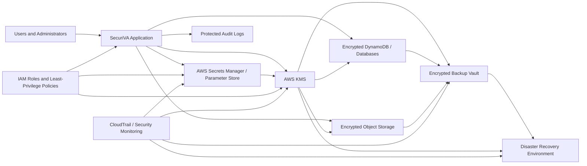

# Encryption Framework Review

> **Review status:** This document contains both the original pre-remediation security assessment and the subsequent implementation status. Findings in Part 1 describe conditions identified during the baseline review before remediation. Current implementation status and remaining limitations are documented in Part 2.

## Part 1 – Baseline Security Assessment (Pre-Remediation)

## Sensitive Data Inventory

| Data | Where used or stored | Current protection | Risk or question |
|---|---|---|---|
| Google OAuth client secret | Backend environment | Environment variable | Confirm production secret storage |
| Google OAuth tokens | To be investigated | Unknown | May be stored in plain text |
| JWT secret | Backend environment | Environment variable | Confirm strength and rotation |
| Voice-session JWT | Backend and VAPI flow | Signed, short-lived token | Confirm it is never logged |
| OpenAI/Groq API keys | Backend environment | Environment variable | Confirm not exposed to frontend |
| User email and ID | Backend/session storage | To be investigated | Confirm encryption and retention |
| Gmail and Calendar data | Backend integrations | To be investigated | Confirm storage and logs |
| Voice transcripts | Voice processing flow | To be investigated | Confirm storage and deletion |

## Environment and Secret Configuration Review

The backend expects sensitive values to be provided through environment variables rather than hard-coded directly in the application.

### Sensitive variables identified

- `OPENAI_API_KEY`
- `GROQ_API_KEY`
- `JWT_SECRET_KEY`
- `GOOGLE_CLIENT_SECRET`
- `SF_CLIENT_SECRET`
- `TELESIGN_API_KEY`
- `DEEPGRAM_API_KEY`

### Security-related configuration identified

- `ENVIRONMENT`
- `COOKIE_SECURE`
- `COOKIE_SAMESITE`
- `ENABLE_TOOL_LOGGING`
- `TELESIGN_USE_ENCRYPTED`
- `VAPI_SERVER_URL`

### Initial observations

- The example file uses placeholder values rather than real credentials.
- Secret values are expected to be loaded from the backend environment.
- Production secret storage still needs to be confirmed.
- Cookie security settings need to be checked in the application code.
- Tool logging needs review to confirm that tokens or user data are not written to logs.

## OAuth Credential Storage Review

### Current design identified

- The project currently references `oauth.json` as centralized credential storage.
- The migration script describes `oauth.json` as plaintext storage.
- A migration path exists to move credentials to encrypted DynamoDB storage.
- The encrypted storage requires a `MASTER_ENCRYPTION_KEY`.
- The migration supports a dry-run mode before writing changes.

### Security concern identified

The migration path was reviewed for possible exposure of sensitive values and unnecessary personal or organization identifiers in terminal output. Credential values, access tokens, refresh tokens, secrets, and unnecessary identifiers should not be displayed in migration output or application logs.

### Initial recommendation

- Remove or redact credential and token output.
- Avoid printing personal or organization identifiers unless required.
- Confirm whether the DynamoDB migration has been completed in production.
- Confirm how `MASTER_ENCRYPTION_KEY` is stored and rotated.
- Confirm that plaintext `oauth.json` is securely deleted after successful migration.

## DynamoDB Credential Encryption Review

### Confirmed behavior

- The DynamoDB credential manager uses a dedicated encryption service.
- Credential data is encrypted before it is written to DynamoDB.
- Encrypted bytes are Base64-encoded for storage.
- The stored field is named `encrypted_data`.
- Credential storage raises an error when the encryption service is unavailable, rather than storing plaintext.
- Optional credential expiration is supported through DynamoDB TTL.
- AWS region and credentials are loaded through environment variables.

### Items still requiring review

- Encryption algorithm and mode.
- How the master encryption key is generated.
- Where the master encryption key is stored in production.
- Whether every encrypted value uses a unique nonce or initialization vector.
- Whether encryption includes integrity/authentication protection.
- Key rotation and recovery procedures.
- Whether AWS credentials should rely on an IAM role instead of long-lived environment keys.

## Encryption Service Review

### Confirmed protections

- Credentials are encrypted using AES-256-GCM.
- AES-GCM provides confidentiality and authentication protection.
- A fresh random 12-byte nonce is generated for each encryption operation.
- The authentication tag is verified during decryption.
- Decryption fails if the key is incorrect or the encrypted data has been modified.
- The encryption key is derived using PBKDF2 with SHA-256.
- PBKDF2 currently uses 100,000 iterations.
- A key-rotation method exists.
- The master key is loaded from `MASTER_ENCRYPTION_KEY`.

### Security concern identified

The encryption salt falls back to the hard-coded value:

`securiva-salt-v1`

Production should not silently use a predictable default salt.

### Recommendations

- Require `ENCRYPTION_SALT` to be explicitly configured in production.
- Store `MASTER_ENCRYPTION_KEY` and `ENCRYPTION_SALT` in an approved secret-management system.
- Confirm that production is not using the default salt.
- Document key rotation, backup, recovery, and emergency revocation procedures.
- Add automated tests for tampered ciphertext, wrong keys, unique nonces, and key rotation.

## Authentication Cookie and JWT Review

### Confirmed protections

- Authentication cookies use `HttpOnly`.
- Production cookies can be restricted to HTTPS through `COOKIE_SECURE`.
- SameSite protection is configurable.
- Cookies are scoped to the current host.

### Security concerns

- Session cookies currently allow a 30-day lifetime.
- The manual-login JWT includes `sub` and `iat`, but no `exp` expiration claim.
- User email addresses are included in redirect URLs and may appear in browser history or logs.
- JWT security depends on `JWT_SECRET_KEY` being securely configured.

### Recommendations

- Add an explicit JWT expiration claim.
- Consider a shorter session lifetime for sensitive accounts.
- Remove email addresses from redirect query strings.
- Require a strong `JWT_SECRET_KEY` at application startup.
- Add tests for expired and invalid JWTs.

## JWT Validation Review

### Confirmed protections

- `JWT_SECRET_KEY` is required before the token verifier starts.
- Tokens are verified using the `HS256` algorithm.
- Invalid signatures and malformed tokens are rejected.
- Expired tokens are rejected when an `exp` claim exists.

### Security concerns

- The manual-login JWT currently has no `exp` claim, so it may remain cryptographically valid after the browser cookie expires.
- Token-validation errors are printed directly to the terminal.
- The verifier returns an access token even when optional claims such as `client_id` are missing.

### Recommendations

- Add a required `exp` claim to every authentication JWT.
- Require important claims such as `sub`, `iat`, and `exp` during decoding.
- Replace direct `print()` statements with structured, redacted security logging.
- Add automated tests for expired, malformed, wrong-signature, and missing-claim tokens.

## Voice Session JWT Review

### Confirmed protections

- Voice-session tokens include `sub`, `type`, `iat`, and `exp`.
- Voice-session tokens expire after 5 minutes.
- Tokens are signed using `HS256`.
- The raw API key remains in an `HttpOnly` cookie and is exchanged for a short-lived voice token.
- Invalid or missing API keys are rejected before a voice token is issued.

### Remaining checks

- Confirm the production `JWT_SECRET_KEY` is strong and shared consistently between token creation and validation.
- Confirm the voice token reaches VAPI metadata and the backend webhook correctly.
- Confirm voice-session events do not log the token value.

## Activity Logging Review

### Confirmed behavior

- Activity events may be stored in DynamoDB or a local file.
- Entries include event type, timestamp, status, user email and user ID.
- Optional `details` and `error` values are stored with the event.
- Voice-session logging currently records the event and user ID, but not the voice token directly.

### Security concerns

- Arbitrary `details` are stored without visible redaction.
- Full error messages may contain credentials, tokens, personal information or internal system details.
- User email addresses and IDs are retained in activity logs.
- The retention period and access controls for these logs are not yet confirmed.

### Recommendations

- Add centralized redaction for tokens, API keys, passwords, cookies and authorization headers.
- Sanitize error messages before saving them.
- Minimize personal identifiers in logs.
- Define log retention and deletion requirements.
- Restrict access to activity logs.
- Add tests confirming sensitive values are never stored.

## Activity Log Storage and Retention Review

### Confirmed protections

- DynamoDB activity records include a TTL value.
- DynamoDB logs are designed to expire automatically after `LOG_TTL_DAYS`.
- A local file fallback prevents complete loss of audit records when DynamoDB is unavailable.

### Security concerns

- Local fallback logs do not show an automatic expiration or deletion mechanism.
- Local log entries are written as complete JSON records without visible encryption or redaction.
- Local files may contain user email, user ID, arbitrary details and full error messages.
- A DynamoDB failure may cause sensitive records to remain locally for an unlimited period.
- DynamoDB write errors are printed directly to the terminal.

### Recommendations

- Apply the same retention policy to local fallback logs.
- Redact sensitive values before both DynamoDB and file storage.
- Restrict local log-file permissions.
- Encrypt sensitive local logs or avoid storing sensitive fields.
- Rotate and delete local logs automatically.
- Replace direct error printing with sanitized structured logging.

## Logging Configuration Review

### Confirmed configuration

- DynamoDB logging is enabled through `USE_DYNAMO_LOGS`.
- The DynamoDB table is `SecuriVALogs`.
- The configured AWS region is `us-east-2`.
- DynamoDB activity logs use a 90-day TTL.
- Local fallback logs are written to `backend/logs/activity.json`.

### Security concerns

- `USE_DYNAMO_LOGS` defaults to `false`, which may cause local file logging unless production overrides it.
- Local fallback logs do not have an equivalent 90-day deletion policy.
- Local logs may contain personal identifiers, arbitrary details and full error messages.
- The DynamoDB table name and AWS region are hard-coded.
- No visible encryption or permission-hardening is applied to the local file.

### Recommendations

- Require explicit production logging configuration.
- Apply retention and rotation to `activity.json`.
- Redact sensitive values before all log writes.
- Restrict local log-file permissions.
- Make the table name, region and retention period configurable.
- Confirm DynamoDB encryption-at-rest and access-control settings in AWS.

## AI Request and Response Logging Review

### Confirmed behavior

- AI activity is written to `backend/my_app/server/ai_calls.log`.
- Each log entry includes:
  - user ID
  - selected model
  - complete AI messages
  - complete AI response
- Logging uses a rotating file handler.
- Each file is limited to approximately 5 MB.
- Up to five rotated backup files may be retained in addition to the active file.

### Positive control

- Log rotation limits uncontrolled file growth.

### High-priority security concerns

- Complete prompts and AI responses are written to a local plaintext log.
- Messages may include email, calendar, chat, customer or business information.
- No redaction or sensitive-data filtering is visible before logging.
- No encryption is visible for the AI log files.
- User IDs are stored alongside complete conversation content.
- Rotated backup files extend the period during which sensitive content remains accessible.
- No time-based retention or secure deletion policy is visible.

### Recommendations

- Do not log complete AI prompts or responses in production.
- Log only operational metadata such as request ID, model, duration, token count and success status.
- Add centralized redaction for credentials, tokens, email addresses and personal information.
- Disable detailed AI logging by default in production.
- Restrict file permissions for AI logs.
- Define a time-based retention and secure deletion policy.
- Add automated tests confirming that prompts, responses and secrets are not written to logs.

## Chat Endpoint Data-Logging Review

### Confirmed behavior

- The `/api/chat` endpoint accepts user-supplied messages, model and API values.
- It sends the complete message list to `execute_chat_with_tools`.
- After execution, `log_ai_call` stores the full message list and complete result.
- The activity logger separately stores the latest user message, truncated to 200 characters.
- Activity logs also store the selected model, API and tool-call count.

### High-priority security concerns

- User conversation content is duplicated across two logging systems.
- Complete prompts and AI responses are stored in the AI-call log.
- The activity log stores up to 200 characters of the latest user message.
- Tool-enabled results may include email, calendar, customer or other connected-account data.
- Truncating a message does not make it non-sensitive.
- There is no visible consent, redaction or production-only disablement before logging.
- Multiple copies of the same sensitive content increase exposure and retention risk.

### Recommendations

- Remove complete prompts and responses from production logs.
- Remove `user_message` content from activity logs.
- Store only non-content metadata such as request ID, model, status, duration and tool-call count.
- Add a production-safe logging flag that defaults to disabled for message content.
- Apply centralized secret and personal-data redaction before all logging.
- Add tests confirming that chat content and tool results are not written to log files.

## Git Protection Review

### Confirmed protections

- `backend/my_app/server/oauth.json` is explicitly excluded by `.gitignore`.
- `backend/local.db` is excluded.
- Credential and secret JSON filename patterns are excluded.
- Certificate and private-key file patterns are excluded.
- Several deployment-secret files are explicitly excluded.

### Security concerns

- `.gitignore` does not remove files that were committed previously.
- Repository history has not yet been checked for previously committed OAuth files or credentials.
- Filename-based rules may not protect secrets stored under unexpected names.

### Recommendations

- Confirm `oauth.json` is not currently tracked by Git.
- Review Git history for previously committed secrets.
- Use automated secret scanning in CI.
- Rotate any credential that may have entered repository history.
- Keep production credentials in a managed secret store rather than local files.

### Git history verification

- Confirmed: `backend/my_app/server/oauth.json` is not currently tracked by Git.
- Confirmed: no Git commit history was found for that exact file path.

## Google OAuth Callback Credential Storage Review

### Confirmed behavior

- After successful Google OAuth authentication, the application calls `credentials.to_json()`.
- The serialized Google credentials are stored under the user’s Google service record.
- The full user-data structure is written to the local `oauth.json` file using `json.dump`.
- A generated application API key is also passed to `store_api_key` with the same OAuth file path.
- The OAuth file is excluded from current Git tracking.

### Critical security concerns

- Google OAuth credentials are written to a local plaintext JSON file.
- The serialized credentials may include access tokens, refresh tokens, client configuration and expiry information.
- No encryption is visible before writing the file.
- No restrictive file permissions are applied in the visible code.
- The application API key may also be stored in the same plaintext file.
- A compromise of the local file could expose multiple users and connected Google accounts.
- The file is rewritten as one centralized credential store, increasing the impact of file exposure.

### Recommendations

- Stop storing production OAuth credentials in plaintext JSON.
- Store credentials only in the encrypted DynamoDB credential manager.
- Encrypt credentials before persistence using the existing encryption service.
- Use least-privilege AWS IAM permissions for the credential table.
- Remove plaintext credentials after a verified migration.
- Restrict any temporary local credential file to development only.
- Add tests confirming that access tokens, refresh tokens, client secrets and API keys are never written to plaintext files.

## Application API Key Storage Review

### Confirmed protections

- The generated application API key is not visibly stored in full.
- The code stores a hash of the API key using `hash_api_key`.
- A limited key prefix is stored for identification.
- Creation and last-used metadata are also retained.

### Remaining concerns

- The hashed API-key record is stored inside the same plaintext `oauth.json` file as Google OAuth credentials.
- The security of the stored hash depends on the implementation of `hash_api_key`, which still needs review.
- Local file permissions and retention controls remain unconfirmed.

### Recommendations

- Continue storing only a non-reversible API-key hash.
- Review the hash algorithm and comparison method.
- Use constant-time comparison when validating API keys.
- Move API-key metadata out of the shared plaintext OAuth file.
- Store production API-key records in a protected database with least-privilege access.

## API Key Hashing Review

### Confirmed behavior

- API keys are hashed using SHA-256 before storage.
- Only the hexadecimal hash is stored for validation.
- A 12-character prefix is retained for display and identification.

### Positive controls

- The complete API key is not stored in the visible persistence code.
- SHA-256 is a one-way cryptographic hash.
- Long randomly generated API keys are resistant to practical brute-force recovery.

### Security concerns

- The API-key hash is not protected with a server-side secret or pepper.
- Identical API keys produce identical hashes.
- `get_key_prefix` returns the complete key when the key is 12 characters or shorter.
- The validation comparison method still needs review.

### Recommendations

- Use an HMAC-based hash with a server-side secret for stored API-key fingerprints.
- Alternatively, retain SHA-256 only when keys are cryptographically random and sufficiently long.
- Never return or store an entire short API key as its prefix.
- Limit displayed prefixes to a safe number of characters.
- Use constant-time comparison during API-key validation.

## API Key Validation Review

### Confirmed behavior

- The supplied API key is hashed before comparison.
- The stored hash is compared using the normal `==` operator.
- A successful match returns the associated user ID.
- The user’s `last_used` timestamp is updated after successful validation.
- Development mode supports a bypass API key.
- The default development bypass value is `dev-bypass`.
- Authentication timing information is printed to the terminal.

### Security concerns

- Hash comparison does not use a constant-time comparison function.
- The default development bypass key is predictable.
- A development configuration accidentally used in production could permit unauthorized access.
- Authentication timing output may expose unnecessary internal diagnostic information.
- The OAuth file is loaded for every validation request, which also keeps plaintext credential storage in the authentication path.

### Recommendations

- Replace normal hash equality with `hmac.compare_digest`.
- Remove the hard-coded `dev-bypass` fallback.
- Require `DEV_API_KEY` to be explicitly configured when development bypass is enabled.
- Fail safely if a development bypass key is missing.
- Ensure development bypasses cannot run when `ENVIRONMENT=production`.
- Replace direct timing prints with sanitized debug logging disabled in production.

## API Key Generation Review

### Confirmed protections

- API keys are generated using Python’s cryptographically secure `secrets` module.
- Each key uses `secrets.token_urlsafe(32)`.
- The generated value contains approximately 256 bits of randomness before encoding.
- Keys use the `sk_live_` prefix.
- The plaintext key is intended to be shown to the user only once.
- Only a hash and limited prefix are stored afterward.

### Assessment

- The generation method is strong and appropriate for production API keys.
- The long random value makes brute-force recovery from a SHA-256 hash impractical.
- The remaining improvements are constant-time validation, safer prefix handling and removal of the predictable development bypass.

## Master Encryption Key Initialization Review

### Confirmed protections

- `MASTER_ENCRYPTION_KEY` is loaded from the environment.
- The encryption service raises an error when the master key is missing.
- The master key is not visibly printed or logged.
- The service derives a 256-bit key using PBKDF2 with SHA-256.
- PBKDF2 uses 100,000 iterations.
- The derived key is used with AES-GCM.

### Security concerns

- Missing-key validation occurs when `CredentialEncryptionService` is instantiated, not necessarily during application startup.
- Production startup may succeed without the master key if the encryption service is not initialized immediately.
- `ENCRYPTION_SALT` falls back to the hard-coded value `securiva-salt-v1`.
- Reusing the same master key and default salt across deployments would derive the same encryption key.

### Recommendations

- Validate `MASTER_ENCRYPTION_KEY` during production application startup.
- Require `ENCRYPTION_SALT` explicitly in production.
- Remove the hard-coded production salt fallback.
- Store the master key and salt in an approved managed secret store.
- Add startup tests confirming production cannot run without required encryption configuration.

## Encryption Service Initialization Review

### Confirmed behavior

- The encryption service uses a singleton instance.
- `_encryption_service` is initialized to `None`.
- `CredentialEncryptionService` is created only when `get_encryption_service()` is first called.
- The master encryption key is therefore validated lazily rather than during application startup.
- The service includes a credential key-rotation method.

### Security concerns

- Production may start successfully without `MASTER_ENCRYPTION_KEY`.
- A missing or invalid key may remain undetected until the first credential operation.
- Health checks may report the application as available even though encrypted credential operations will fail.
- Key rotation behavior depends on the old master key and requires automated verification.

### Recommendations

- Validate required encryption configuration during production startup.
- Add a startup readiness check for the master key and encryption salt.
- Do not expose the key values in readiness output or logs.
- Add automated tests for encryption, decryption, authentication failure and key rotation.

## Plaintext OAuth File Cleanup Review

### Confirmed finding

- No `Path.unlink()` cleanup was found for `backend/my_app/server/oauth.json`.
- The existing `unlink()` calls relate only to tests and TeleSign log cleanup.
- No verified automatic deletion of the plaintext OAuth credential file has been identified after DynamoDB migration.

### Security concern

- Plaintext OAuth credentials may remain on disk after encrypted migration.
- This conflicts with the policy requirement that OAuth tokens must not be stored in plaintext.

### Recommendation

- Delete the plaintext OAuth file only after every credential record has been encrypted, stored and verified successfully.
- Create a protected backup only when explicitly required for rollback.
- Abort cleanup if any migration record fails.
- Record a sanitized migration result without printing token values.

- A repository-wide search also found no `os.remove()` operation for deleting the plaintext OAuth credential file.

## Application Startup Secret Validation Review

### Confirmed behavior

- The top-level Starlette application uses a `lifespan` startup function.
- Startup initializes the MCP session manager and cleanup task.
- Shutdown closes MCP connections.
- No validation of `MASTER_ENCRYPTION_KEY`, `ENCRYPTION_SALT`, or `JWT_SECRET_KEY` is visible in the top-level lifespan function.
- The startup function does not initialize `CredentialEncryptionService`.

### Security concern

- The application may start successfully with missing encryption configuration.
- Health checks may report the service as available even though credential encryption or decryption will fail later.
- Configuration errors may remain undetected until a sensitive operation is attempted.

### Recommendation

- Add a production startup validation function.
- Require `MASTER_ENCRYPTION_KEY`, `ENCRYPTION_SALT`, and `JWT_SECRET_KEY` in production.
- Fail startup safely when required secrets are absent.
- Never print secret values in startup errors or logs.
- Add automated tests proving that production startup fails when required secrets are missing.

## Existing Encryption Test Coverage Review

### Confirmed finding

- A search for `CredentialEncryptionService` within `backend/tests` returned only one reference.
- The result appears to be a parameter description or type reference in `dynamodb_credential_manager.py`.
- No dedicated automated test for `CredentialEncryptionService` was identified through this search.

### Test coverage gaps

- Encryption and decryption round-trip testing
- Rejection of modified or corrupted ciphertext
- Missing master-key behavior
- Missing production salt behavior
- Key-rotation validation
- Prevention of plaintext credential persistence
- Logging redaction tests

### Recommendation

- Add focused automated security tests before treating the Encryption Framework as validated.
- Preserve terminal test results as implementation evidence.

### Encryption test search clarification

- Two calls to `encrypt_credentials()` were found in `backend/tests/dynamodb_credential_manager.py`.
- These results confirm that the credential manager uses the encryption service.
- The search results do not yet confirm that dedicated pytest test cases or security assertions exist.
- Test coverage for encryption round trips, ciphertext tampering, missing keys, production configuration, and key rotation remains to be verified.

### Final encryption test verification

- A search for `def test_` in `backend/tests/dynamodb_credential_manager.py` returned no results.
- The file uses the encryption service but does not contain identifiable pytest test functions.
- Dedicated automated tests for encryption, decryption, ciphertext integrity, key rotation, missing configuration, logging redaction and plaintext credential prevention still need to be created.

## Encryption Framework Requirement Gap Analysis – Baseline Assessment

> The statuses in this table reflect the original baseline assessment before the remediation work documented in Part 2.

| Requirement | Current Status | Confirmed Gap | Required Action | Evidence Needed |
|---|---|---|---|---|
| AES-256-GCM credential encryption | Partially implemented | Encryption service exists, but configuration is validated only when first used | Add production startup validation and automated tests | Source-code review and passing encryption tests |
| Protect OAuth credentials at rest | Not compliant | Google OAuth tokens are written to plaintext `oauth.json` | Move production credentials to encrypted DynamoDB storage and remove plaintext persistence | Storage inspection and plaintext-secret test |
| Remove plaintext file after migration | Not implemented | No `unlink()` or `os.remove()` cleanup was found | Delete the plaintext file only after successful encrypted migration and verification | Migration test and file-system evidence |
| Secure AI logging | Not compliant | Full prompts and AI responses are stored in plaintext logs | Replace content logging with safe operational metadata and redaction | Sanitized log sample and automated test |
| Secure activity logging | Partially implemented | User-message previews, arbitrary details and errors may contain sensitive information | Remove unnecessary content and add centralized redaction | Activity-log test and sanitized sample |
| Local log retention | Not implemented | Local fallback logs have no confirmed rotation or deletion policy | Add rotation, retention and restricted permissions | Configuration evidence and cleanup test |
| API-key generation | Implemented | No major generation weakness found | Retain cryptographically secure generation | Unit test confirming length and uniqueness |
| API-key validation | Partially implemented | Normal equality is used instead of constant-time comparison | Replace comparison with `hmac.compare_digest` | Valid-key and invalid-key tests |
| Development bypass security | Not compliant | Predictable default value `dev-bypass` exists | Remove the default and block development bypass in production | Production configuration test |
| Production secret validation | Not implemented | Startup does not validate encryption key, salt or JWT secret | Add startup validation that fails safely without exposing secret values | Startup failure tests |
| Encryption security tests | Not implemented | No dedicated pytest tests were found | Add encryption, decryption, tampering, rotation and missing-key tests | Passing pytest output |
| Secure KMS or vault | Roadmap / not implemented | No confirmed managed KMS integration exists | Design and implement an isolated KMS-backed key provider | Architecture, IAM and KMS configuration evidence |
| Continuous key backup | Roadmap / not implemented | No confirmed immediate backup of new or rotated keys | Ensure key creation and rotation include immediate protected replication | Backup verification test |
| Two-hour key recovery | Roadmap / not tested | No tested recovery procedure exists | Document and test recovery against the 2-hour RTO | Timed recovery exercise |
| Two-person recovery authorization | Roadmap / governance control | No confirmed multi-party approval workflow exists | Define separate requester and approver roles for recovery | IAM policy and approval evidence |
| Recovery audit logging | Roadmap / not implemented | No confirmed immutable key-recovery audit trail exists | Record access, copy, restoration and deletion attempts in protected logs | Audit-log sample |
| Secure key restoration | Roadmap / not tested | Encrypted restoration and integrity verification are not confirmed | Use authenticated encrypted channels and verify restored-key integrity | Restoration and integrity test |
| AWS regional failover | Roadmap / not implemented | No confirmed KMS recovery in a secondary region | Define primary and recovery regions and regional recovery procedure | Failover architecture and tabletop evidence |

## Baseline Remediation Priorities

> The priorities below reflect the original assessment. Current completion status is documented in Part 2 under “Remediation Implementation Status.”

### Critical — address first

1. Stop storing Google OAuth credentials in plaintext `oauth.json`.
2. Stop logging complete AI prompts and responses.
3. Remove user-message content and sensitive errors from activity logs.
4. Validate `MASTER_ENCRYPTION_KEY`, `ENCRYPTION_SALT`, and `JWT_SECRET_KEY` during production startup.
5. Create dedicated encryption security tests.

### High

1. Replace API-key hash comparison with `hmac.compare_digest`.
2. Remove the default `dev-bypass` API key.
3. Add centralized sensitive-data redaction.
4. Add local log rotation, retention, and permission controls.
5. Delete plaintext OAuth storage only after encrypted migration is successfully verified.

### Medium

1. Improve API-key prefix handling.
2. Replace direct terminal printing with sanitized structured logging.
3. Make logging table name, AWS region, and retention settings configurable.
4. Document retention periods for credentials, logs, AI content, and backup files.

### Architecture and Disaster-Recovery Roadmap

1. Design an AWS KMS-backed key provider.
2. Define primary and recovery AWS regions.
3. Support immediate backup or replication of new and rotated keys.
4. Define two-person authorization for emergency key recovery.
5. Create immutable recovery audit logging.
6. Define secure restoration and automated integrity verification.
7. Test key restoration against the approved 2-hour RTO.

## Part 2 – Approved Remediation and Current Implementation Status

## Management Approval and Additional Recommendations

The proposed Encryption Framework remediation plan was reviewed and approved by SecuriVA management.

Approved scope:
- Proceed with critical and high-priority security remediation.
- Create and execute automated encryption and security tests.
- Document AWS KMS integration, regional disaster recovery, two-person authorization, secure key lifecycle management, and related controls as Stage 2 target architecture unless implementation is specifically required.
- Follow the normal development workflow with review and testing before merge.

Additional approved documentation requirements:
- Encryption standards for AI Meeting Listening, Recording & Smart Reporting, including audio recordings, transcripts, AI-generated summaries, and meeting metadata.
- Enterprise key lifecycle management covering generation, rotation, archival, revocation, destruction, and recovery.
- Future BYOK and Customer Managed Keys support.
- Data Classification and Encryption Policy for Public, Internal, Confidential, Restricted, and Highly Sensitive information.
- AWS Secrets Manager / Parameter Store integration for API keys, OAuth credentials, JWT secrets, AI provider credentials, and database passwords.
- Post-Quantum Cryptography readiness as a future roadmap item.
- Compliance mapping to NIST CSF 2.0, NIST SP 800-57, NIST SP 800-38D, ISO/IEC 27001, SOC 2, and PCI DSS where applicable.
- Encryption requirements for AI-generated reports, uploaded documents, CRM data, audit logs, and future knowledge-base storage.
- Future security testing covering encryption performance benchmarking, penetration testing, key-compromise simulations, disaster-recovery validation, and cryptographic compliance verification.
- A Key Management Architecture diagram covering the application, AWS KMS, Secrets Manager, encrypted databases, backup vaults, and disaster-recovery environments.
- A Future Architecture & Implementation Roadmap separating:
  1. Current implementation
  2. Approved Stage 2 enhancements
  3. Future enterprise features
  4. Long-term roadmap

### Team 1 Governance Alignment

The Encryption Framework is also aligned to the Team 1 Disaster Recovery Governance Framework v2.0 and Incident Response Plan. These documents define the operational handoff for encryption and key-recovery events, including the 2-hour encryption RTO, real-time/continuous key-backup RPO, isolated key vaulting, multi-party recovery authorization, audit logging, encrypted restoration, integrity verification, and the PB-07 key/certificate/secret compromise playbook.

## Remediation Implementation Status

The following approved application-level security remediations have now been implemented and locally verified on the `feature/encryption-framework` branch.

### Implemented

- Replaced normal API-key hash comparison with constant-time comparison using `hmac.compare_digest()`.
- Removed the predictable default development API-key bypass value.
- Added production startup validation for:
  - `MASTER_ENCRYPTION_KEY`
  - `ENCRYPTION_SALT`
  - `JWT_SECRET_KEY`
- Removed complete AI prompt and response content from AI call logging.
- Replaced chat message content in activity logs with metadata-only message counts.
- Sanitized OAuth, chat, SMS, and DynamoDB exception logging to avoid exposing exception contents.
- Redirected new Google OAuth credential storage to the encrypted DynamoDB credential path.
- Removed plaintext Google OAuth credential persistence from the OAuth callback path; new local `oauth.json` records retain non-secret metadata rather than serialized Google credentials.
- Added a production `DynamoDBCredentialManager` module and removed production dependencies on the `tests` package.
- Updated the credential migration script to use the production credential manager.
- Sanitized migration-script console output.
- Corrected the encryption key-derivation implementation to use `PBKDF2HMAC`.

### Automated Test Evidence

A dedicated test suite was added at:

`backend/tests/test_encryption_framework_security.py`

Current result:

- 10 tests passed
- 0 test failures
- 3 unrelated dependency/configuration warnings

The automated tests cover:

- explicit development API-key configuration
- valid and invalid API-key validation
- production startup failure when encryption secrets are missing
- production startup success with explicit test secrets
- AI logging content redaction
- encryption and decryption round-trip
- AES-GCM tamper rejection
- failure when the master encryption key is missing
- encrypted Google credential-storage helper behavior
- regression prevention for plaintext Google OAuth persistence

### Current Limitations and Remaining Hardening

- The changes have been committed locally but have not yet been pushed, reviewed, merged, or deployed.
- The encrypted DynamoDB credential-storage path has not yet been validated end-to-end in a live AWS environment.
- AWS KMS integration is not currently implemented; it remains Stage 2 target architecture.
- Existing plaintext OAuth records require a controlled migration, verification, and secure-deletion process.
- Manual-login JWT expiration and required-claim enforcement remain outstanding application-hardening items.
- Local activity-log rotation, retention, permissions, and secure-deletion controls remain outstanding.
- A repository secret/plaintext scan still needs to be completed and preserved as final evidence.
- Regional disaster recovery, two-person authorization, CMK/BYOK, Secrets Manager integration, and advanced cryptographic testing remain Stage 2 target architecture or roadmap items unless separately required. Incident-response and DR handoff requirements are documented, but production recovery evidence is not yet available.
- The broader repository test suite has unrelated collection and dependency issues; the dedicated Encryption Framework security suite passes independently.

## Future Architecture & Implementation Roadmap

This roadmap separates the current implementation from approved Stage 2 enhancements, future enterprise features, and long-term architectural goals.

### 1. Current Implementation

The current Encryption Framework includes:

- AES-256-GCM authenticated encryption for sensitive credentials.
- PBKDF2-HMAC-SHA256 key derivation.
- Environment-based master encryption key configuration.
- Encrypted credential storage through DynamoDB.
- Constant-time API-key hash comparison.
- Production startup validation for required encryption secrets.
- Metadata-only logging for the remediated AI-call and chat activity paths.
- Sanitized exception and migration-script output.
- Automated security tests covering encryption, tamper detection, startup validation, API-key security, logging redaction, and OAuth credential handling.

### 2. Approved Stage 2 Enhancements

The following controls are approved for Stage 2 implementation or detailed architecture documentation:

- Encryption requirements for AI Meeting Listening, Recording & Smart Reporting.
- Encryption of audio recordings, transcripts, AI-generated summaries, and meeting metadata at rest and in transit.
- Enterprise key lifecycle management covering:
  - key generation
  - activation
  - rotation
  - archival
  - revocation
  - destruction
  - backup
  - recovery
- AWS Secrets Manager or Parameter Store integration for:
  - API keys
  - OAuth credentials
  - JWT secrets
  - AI-provider credentials
  - database passwords
- Data Classification and Encryption Policy covering:
  - Public
  - Internal
  - Confidential
  - Restricted
  - Highly Sensitive
- Key Management Architecture diagram covering:
  - SecuriVA application services
  - AWS KMS
  - AWS Secrets Manager
  - encrypted databases
  - backup vaults
  - disaster-recovery environments
- Compliance mapping to:
  - NIST CSF 2.0
  - NIST SP 800-57
  - NIST SP 800-38D
  - ISO/IEC 27001
  - SOC 2
  - PCI DSS where applicable

### 3. Future Enterprise Features

The following capabilities remain future enterprise features unless separately prioritized:

- Customer Managed Keys.
- Bring Your Own Key support.
- Multi-region AWS KMS architecture.
- Two-person authorization for sensitive key operations.
- Automated key-compromise response.
- Immutable cryptographic audit trails.
- Enterprise key recovery workflows.
- Encryption controls for uploaded documents, CRM records, audit logs, AI-generated reports, and future knowledge-base storage.

### 4. Long-Term Roadmap

Long-term roadmap items include:

- Post-Quantum Cryptography readiness.
- Cryptographic-agility planning.
- Encryption performance benchmarking.
- Penetration testing focused on cryptographic controls.
- Key-compromise simulations.
- Disaster-recovery validation.
- Cryptographic compliance verification.
- Regional failover testing.
- Full production validation of KMS, backup, restore, and recovery controls.

These items are documented as future architecture or roadmap controls and should not be represented as implemented until they are configured, tested, and supported by evidence.

## Data Classification and Encryption Policy

SecuriVA information must be classified according to sensitivity and protected using encryption controls appropriate to the classification level.

| Classification | Examples | Encryption at Rest | Encryption in Transit | Access Requirements |
|---|---|---|---|---|
| Public | Published website content, public documentation, approved marketing material | Optional unless stored with protected data | TLS required for application delivery | Public access permitted after approval |
| Internal | Internal procedures, non-sensitive project notes, general operational information | Encryption recommended | TLS required | Authorized workforce members only |
| Confidential | User profiles, business records, internal reports, meeting metadata, CRM information | Encryption required | TLS required | Role-based access and least privilege |
| Restricted | OAuth credentials, API keys, JWT secrets, database passwords, access tokens, transcripts, recordings, AI-generated reports | Strong encryption required, using approved authenticated encryption and managed secret storage | TLS 1.2 or higher required | Strict role-based access, audit logging, and limited administrative access |
| Highly Sensitive | Master encryption keys, recovery keys, customer-managed keys, cryptographic material, privileged security records | Hardware-backed or managed key protection required; plaintext storage prohibited | Strong encrypted administrative channels required | Multi-party authorization, enhanced monitoring, immutable audit evidence, and formal recovery controls |

### Policy Requirements

- Sensitive credentials, tokens, passwords, private keys, and cryptographic material must never be stored in plaintext.
- Restricted and Highly Sensitive information must use approved authenticated encryption at rest.
- Sensitive information transmitted between users, application services, AI providers, databases, storage systems, and third-party integrations must use encrypted transport.
- Encryption keys must be stored separately from the information they protect.
- Logs must exclude or mask secrets, credentials, unnecessary message content, and protected personal information.
- Backups containing Confidential, Restricted, or Highly Sensitive information must be encrypted and access-controlled.
- Data retention, archival, secure deletion, and recovery requirements must reflect the information classification.
- Any exception to these requirements must be documented, risk-assessed, approved, and tracked for remediation.

## AI Meeting Listening, Recording & Smart Reporting Encryption Requirements

SecuriVA AI meeting features must protect audio recordings, transcripts, AI-generated summaries, reports, and meeting metadata throughout their lifecycle.

### Required Controls

- Audio recordings must be encrypted in transit during upload, streaming, and service-to-service transfer.
- Audio recordings must be encrypted at rest in approved storage.
- Transcripts and AI-generated summaries must be encrypted at rest and in transit.
- Meeting metadata, including participant information, timestamps, identifiers, and organization details, must be protected according to its data classification.
- Temporary processing files must be encrypted where supported and securely deleted after processing when no longer required.
- AI-provider requests must transmit only the minimum necessary content over encrypted connections.
- Sensitive meeting content must not be written into application, AI, activity, or debugging logs.
- Access to recordings, transcripts, summaries, and reports must follow least-privilege and tenant-isolation requirements.
- Retention and deletion rules must be defined for recordings, transcripts, reports, and temporary processing data.
- Backups containing meeting content must be encrypted and included in secure recovery procedures.
- Encryption keys must remain separate from the meeting data they protect.
- Any future recording or smart-reporting integration must complete an encryption and privacy review before production use.

### Current Status

These controls are documented as Stage 2 requirements. They must not be represented as fully implemented until the relevant storage, processing, retention, access-control, and recovery configurations have been verified through technical evidence and testing.

## Enterprise Key Lifecycle Management

SecuriVA must manage cryptographic keys through a defined lifecycle to reduce the risk of unauthorized access, key loss, misuse, or unrecoverable encrypted data.

### Key Lifecycle Stages

- **Generation:** Keys must be generated using approved cryptographic methods and sufficient entropy.
- **Activation:** Keys must be approved and assigned to a defined purpose before use.
- **Storage:** Master keys and other sensitive cryptographic material must be stored separately from encrypted data.
- **Distribution:** Keys must be transferred only through protected and authenticated channels.
- **Use:** Keys must be limited to their approved purpose, environment, service, and authorized users.
- **Rotation:** Rotation periods and emergency rotation triggers must be documented.
- **Revocation:** Compromised, expired, or unauthorized keys must be revoked promptly.
- **Archival:** Retired keys needed for historical decryption must be protected and access-controlled.
- **Destruction:** Keys must be securely destroyed when no longer required and when retention obligations permit.
- **Backup and Recovery:** Recovery copies must be encrypted, isolated, integrity-checked, and subject to restricted access.
- **Audit:** Key generation, access, rotation, recovery, revocation, and destruction events must be logged.

### Governance Requirements

- No single administrator should have unrestricted authority over highly sensitive recovery keys.
- Sensitive key-recovery activities should use multi-party or two-person authorization.
- Emergency key access must be approved, time-limited, documented, and reviewed.
- Application administrators should not automatically have access to master encryption keys.
- Production, staging, development, backup, and recovery environments should use separate keys.
- Key identifiers and metadata may be logged, but key values must never appear in logs.
- Suspected key compromise must trigger containment, rotation, impact assessment, and recovery procedures.

### Current Status

The current application uses environment-based encryption configuration and local key derivation. Full managed key lifecycle controls, including AWS KMS, protected key recovery, multi-party authorization, archival, automated rotation, and enterprise audit evidence, remain Stage 2 target architecture unless separately implemented and validated.

### Disaster-Recovery Recovery Objectives for Encryption

The SecuriVA Disaster Recovery Governance Framework v2.0 assigns the Encryption Framework the following recovery objectives:

- **Recovery Time Objective (RTO): 2 hours.** Master encryption keys and cryptographic functions must be restored and operational within two hours of a declared incident.
- **Recovery Point Objective (RPO): Real-time / continuous.** Newly generated encryption keys must be backed up immediately upon creation.
- Recovery copies of master keys, certificates, and cryptographic assets must be stored in a secure, encrypted, logically isolated KMS or digital vault.
- Recovery access must use multi-party authorization so that no single administrator can unilaterally extract or delete master keys.
- All key-vault access, copy, restore, and deletion attempts must be logged to a protected audit trail.
- Keys must be restored over encrypted channels and verified against cryptographic baselines before use.

## Incident Response Integration for Cryptographic Events

The Encryption Framework integrates with the SecuriVA Incident Response Plan for key, certificate, secret, and cryptographic compromise scenarios.

### Encryption Workstream Responsibilities

During incident response, the Encryption workstream must provide:

- affected secret, key, or certificate scope
- revocation and rotation status
- integrity-validation evidence
- recovery evidence
- confirmation of whether encrypted or signed data may have been affected

### PB-07 – Key, Certificate, or Secret Compromise

For incidents involving exposed or compromised cryptographic material, the required response is:

1. Revoke or rotate the affected key, certificate, token, or secret.
2. Isolate affected services where necessary to prevent continued misuse.
3. Preserve relevant access and audit evidence without copying plaintext secrets into the incident record.
4. Assess the scope of data encrypted, signed, or otherwise protected by the compromised material.
5. Recover through the approved KMS or digital-vault process when recovery is required.
6. Verify restored-key integrity before returning dependent services to operation.
7. Apply two-person or multi-party authorization for sensitive recovery actions where required by the DR framework.
8. Record recovery evidence, approvals, and validation results in the incident record.

### Incident Response to Disaster Recovery Handoff

When an encryption or key-recovery incident cannot be safely resolved in the primary environment, the Incident Commander and DR Lead must activate the relevant disaster-recovery procedure.

Before return to service, the Encryption workstream must provide evidence that:

- required keys or cryptographic services were restored within the defined recovery objective where applicable
- restored keys passed integrity verification
- access controls and authorization requirements remain equivalent to the approved security baseline
- required audit evidence was preserved
- newly restored or rotated cryptographic material has been securely backed up
- recovery did not weaken encryption, key isolation, or access-control requirements

These controls are governance and recovery requirements. They must not be represented as implemented production capabilities until the supporting KMS/vault, backup, authorization, audit, and recovery mechanisms are technically implemented and validated.

## Secrets Management Architecture

SecuriVA should move sensitive application secrets from local files and general environment configuration into an approved managed secrets platform.

### Secrets Covered

The managed secrets platform should protect:

- API keys
- OAuth client secrets and refresh tokens
- JWT signing secrets
- AI-provider credentials
- database passwords
- third-party integration credentials
- encryption-related configuration that is not stored directly in AWS KMS

### Target Architecture

- Use AWS Secrets Manager or AWS Systems Manager Parameter Store for centralized secret storage.
- Applications should retrieve secrets at runtime using assigned IAM roles rather than embedded AWS access keys.
- Secrets must not be committed to source control, included in container images, or written into logs.
- Development, staging, production, backup, and recovery environments should use separate secret records.
- Secret access must follow least privilege and be restricted by service, environment, and purpose.
- Secret access, modification, rotation, and deletion events should be auditable.
- Rotation should be automated where supported and documented where manual.
- Cached secrets should have limited lifetimes and should not be stored in plaintext files.
- Failed secret retrieval should cause sensitive operations to fail safely.
- Recovery procedures must define how required secrets are restored without exposing their values.

### Current Status

The current remediation improves validation and encrypted credential handling, but full AWS Secrets Manager or Parameter Store integration has not been implemented or production-tested. It remains an approved Stage 2 target architecture control.

## Compliance Mapping

The SecuriVA Encryption Framework should be mapped to recognized security and compliance standards so that implemented controls, planned enhancements, and evidence requirements are clearly traceable.

| Standard | Relevant Encryption Framework Areas | Current Treatment |
|---|---|---|
| NIST CSF 2.0 | Data protection, identity and access control, logging, incident response, recovery, governance | Partially implemented and documented; enterprise key management and recovery remain Stage 2 |
| NIST SP 800-57 | Key generation, storage, rotation, revocation, archival, destruction, and recovery | Documented as enterprise key lifecycle requirements; managed lifecycle not yet fully implemented |
| NIST SP 800-38D | AES-GCM authenticated encryption, nonce handling, integrity protection, tamper detection | Implemented through AES-256-GCM and validated through round-trip and tamper-rejection tests |
| ISO/IEC 27001 | Cryptographic controls, access control, logging, secure development, backup, recovery, and supplier security | Partially implemented and documented; formal control mapping and audit evidence remain future work |
| SOC 2 | Security, confidentiality, availability, access logging, change control, and recovery evidence | Application-level controls and tests added; operational and infrastructure evidence still required |
| PCI DSS | Protection of authentication data, encryption in transit and at rest, secrets management, logging, and key management | Applicable only where payment-card data or payment-related systems are in scope |

### Evidence Requirements

Compliance claims must be supported by evidence such as:

- source-code review records
- automated security test results
- secret-scanning results
- encryption configuration evidence
- access-control and IAM policies
- audit-log samples
- key-rotation and recovery procedures
- backup and restore test results
- architecture diagrams
- change-review and approval records

### Current Status

This mapping is for design and planning purposes. SecuriVA must not claim formal certification or full compliance until the relevant controls are implemented, independently reviewed where required, and supported by sufficient operational evidence.

## Key Management Architecture

The target architecture separates application services, secret storage, encryption keys, encrypted data stores, backups, and disaster-recovery environments.

### Architecture Principles

- Application services should access secrets through assigned IAM roles.
- Master keys should be managed separately from encrypted data.
- AWS KMS should perform or authorize cryptographic operations without exposing raw key material to application users.
- Secrets Manager or Parameter Store should protect API keys, OAuth secrets, JWT secrets, database credentials, and AI-provider credentials.
- Databases, object storage, logs, reports, and backups should use encryption appropriate to their data classification.
- Backup vaults should be encrypted and logically separated from primary production systems.
- Disaster-recovery environments should have controlled access to required recovery keys and secrets.
- Sensitive recovery actions should require enhanced authorization and protected audit evidence.
- Key, secret, backup, and recovery events should be monitored through CloudTrail or equivalent security monitoring.
- Production, development, staging, backup, and disaster-recovery environments should use separate keys and secrets.

### Current Status

This diagram represents the approved Stage 2 target architecture. The current application uses local environment configuration and an encrypted DynamoDB credential-storage path. AWS KMS, Secrets Manager, protected backup vaults, regional recovery, and multi-party recovery authorization have not yet been implemented or validated as production controls.

## Security Testing and Validation Roadmap

The Encryption Framework testing program should expand beyond unit and regression testing as SecuriVA moves toward enterprise deployment.

### Current Automated Coverage

The current dedicated security suite validates:

- API-key validation and removal of the predictable development bypass
- production startup secret requirements
- AI logging content redaction
- encryption and decryption round-trip behavior
- AES-GCM tamper rejection
- failure when the master encryption key is missing
- encrypted Google credential-storage behavior
- prevention of plaintext Google OAuth persistence

### Stage 2 Testing

Stage 2 should include:

- encryption performance benchmarking
- secrets and plaintext-data scanning
- credential migration validation
- key-rotation testing
- backup and recovery tabletop testing, including key-compromise and IR-to-DR handoff scenarios
- timed validation of the 2-hour encryption recovery objective where a testable recovery environment exists
- verification that newly generated or rotated keys are backed up immediately
- verification of encrypted restoration, integrity checking, authorization, and audit evidence during recovery
- verification of encryption for AI reports, uploaded documents, CRM data, audit logs, and future knowledge-base storage
- review of TLS and encryption-at-rest configuration evidence

### Future Enterprise Testing

Future enterprise validation should include:

- penetration testing focused on cryptographic controls
- key-compromise simulations
- disaster-recovery restoration testing
- regional failover testing
- cryptographic compliance verification
- AWS KMS and Secrets Manager access-policy testing
- Customer Managed Key and BYOK lifecycle testing
- Post-Quantum Cryptography readiness assessments

### Evidence Requirements

Each test should record:

- scope and environment
- test method
- expected result
- actual result
- pass or fail status
- defects and remediation actions
- reviewer or approver
- supporting logs, screenshots, or reports

These advanced tests remain Stage 2 or future roadmap activities unless separately scheduled and approved.